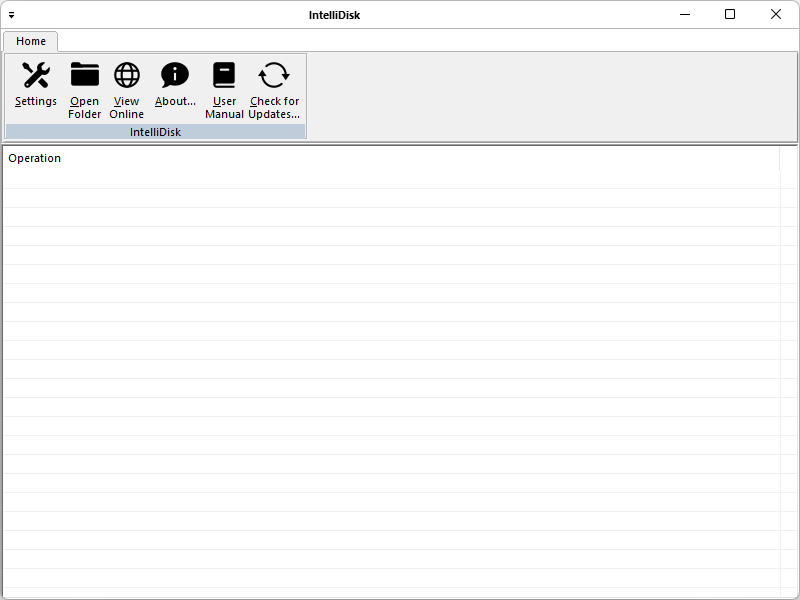

[IntelliDisk](https://www.moga.doctor/#intellidisk-top) is an alternative Windows version to the famous Microsoft OneDrive!

This application is developed in Microsoft Visual C++, and it is licensed under GNU General Public License v3.0.

This open source application has a Setup project to be deployed on Microsoft Windows 10+ machines.

Contributions are welcome. Be mindful of our [Contribution Rules](CONTRIBUTING.md) to increase the likelihood of your contribution getting accepted.

# What is client-server application?

A client-server application is a program that runs on the client-side while accessing the information over a remote server. The client-server always makes requests to the remote server by calling functions of the server to retrieve information. The client program and the server program may run on different systems and on different platforms where they require a communications layer known as middleware.

The client-server application might run on a network client or a network server. The applications are solely described on their architecture except for the fact that how it is deployed on the network. It uses a two-tier architecture that has two users; the client and the server.

The server machine acts as a host that can run single or multiple server programs that share their resources with the clients. Sometimes the server gets overloaded when simultaneous requests are received from the client.

The communication between the client and server is a two-way street. Servers can reach the client to make sure that the client has appropriate updates, patches, or if there are any other requirements. Once the inquiry is done, the server closes the connection to the client so that the bandwidth space and the network are conserved.

## Features of client-server application

Some of the typical features of client-server applications are as follows:
- Multiple client programs have the ability to request services from a single server;
- A single client program can request services from multiple server programs;
- A single server program has the ability to provide multiple services;
- The client program doesn’t have to be aware of the number of subprograms that provide a service;
- Multiple subprograms have the ability to work together to provide a service;
- The server programs run on a machine that is remote from the machine that runs the client program.

# Setup of this application

- Install  [MySQL ODBC connector](https://dev.mysql.com/downloads/connector/odbc/);
- Choose a MySQL hosting service and create the MySQL database;
- Configure Server instance (create `IntelliDisk.xml` configuration file):

```xml
<?xml version="1.0" encoding="UTF-16" standalone="no"?>
<xml>
    <IntelliDisk>
        <ServicePort>8080</ServicePort>
        <HostName>localhost</HostName>
        <HostPort>3306</HostPort>
        <Database>MySQL_database</Database>
        <Username>MySQL_username</Username>
        <Password>MySQL_password</Password>
    </IntelliDisk>
</xml>
```
- Configure Client instance (change Servers's IP & Port):


_Note: you should check the option "Start IntelliDisk automatically when I sign in to Windows"._
